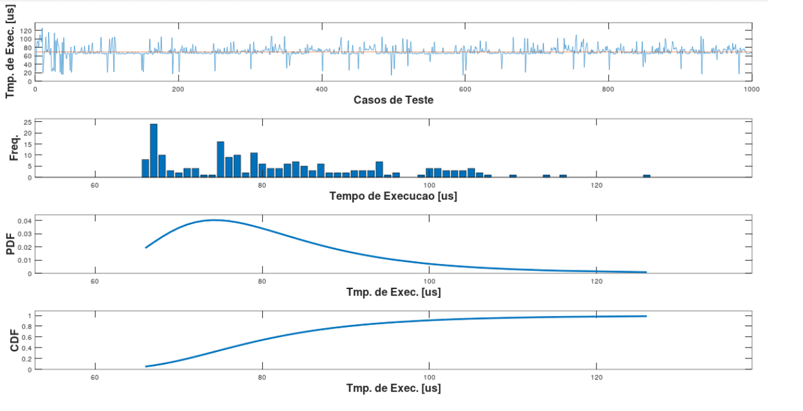
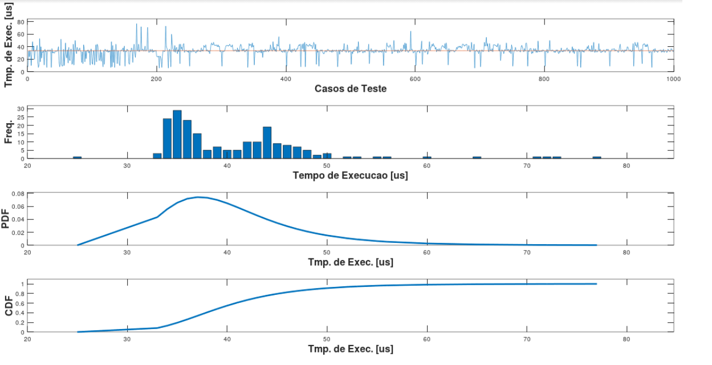
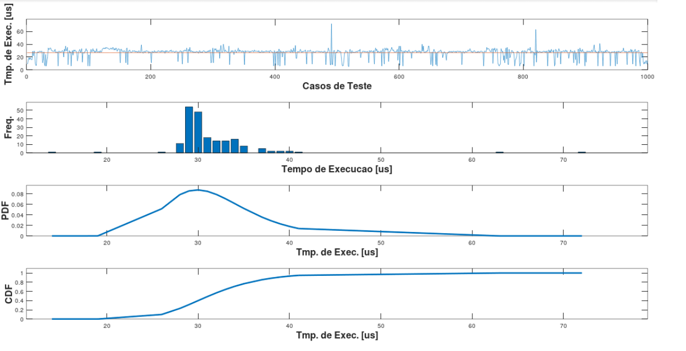
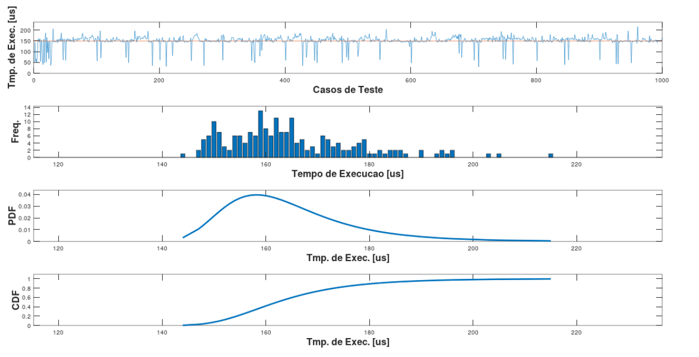

# Software em tempo real

**Implemente algum algoritmo de ordenação de vetores em C, e faça uma análise por medição e estatística dos tempos de execução desse algoritmo.**

Nesta análise foi utilizado um algoritmo para fazer 4 tipos de ordenação de vetores, sendo eles: shell sort, selection sort, insertion sort e bubble sort.

Foi utilizado um tamanho fixo de 100 valores aleatórios entre 0 e 100 para os vetores, tendo 1000 amostras para cada algoritmo de ordenação.

Para a análise estatística, foi utilizado o TVE(Teoria dos Valores Extremos) com a abordagem BM(Máximo dos blocos), sendo assim feito uma distribuição GVE(Generalizada de valores extremos).

## **Selection sort**

## **Insertion sort**

## **Shell sort**

## **Bubble sort**

